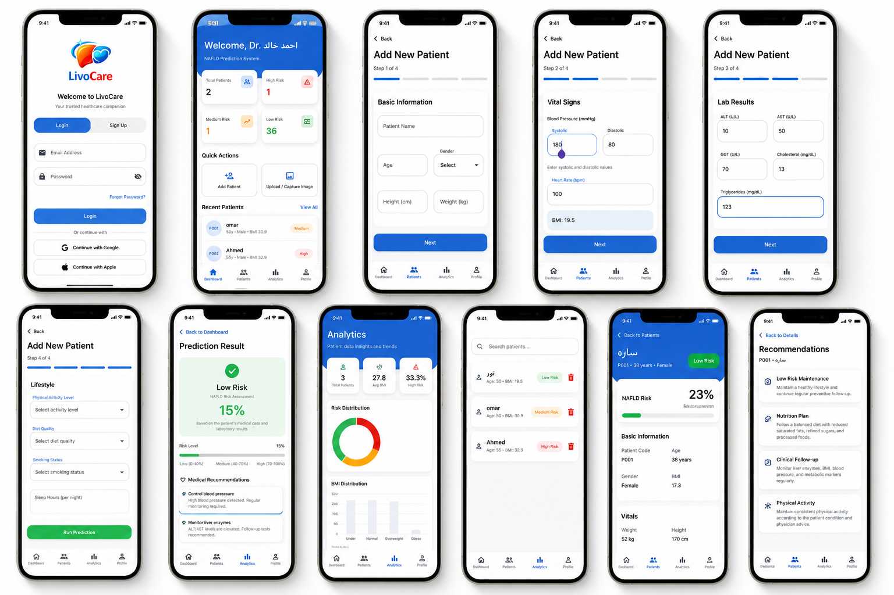
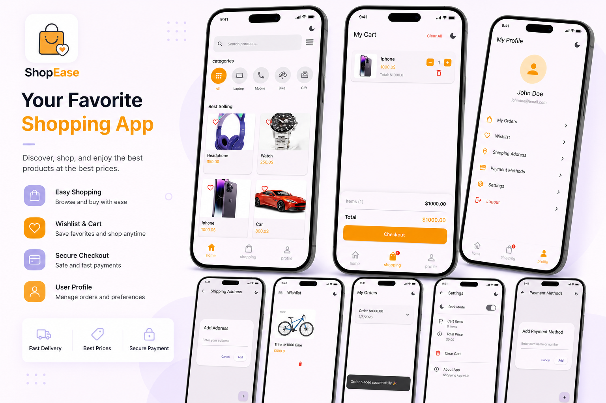
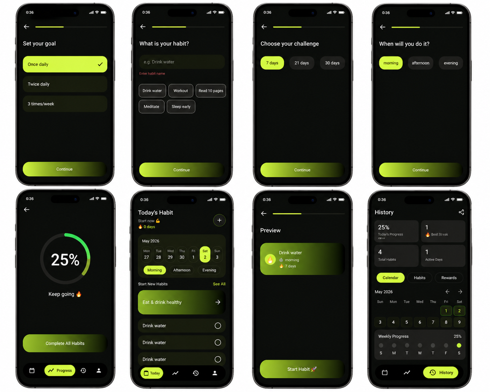
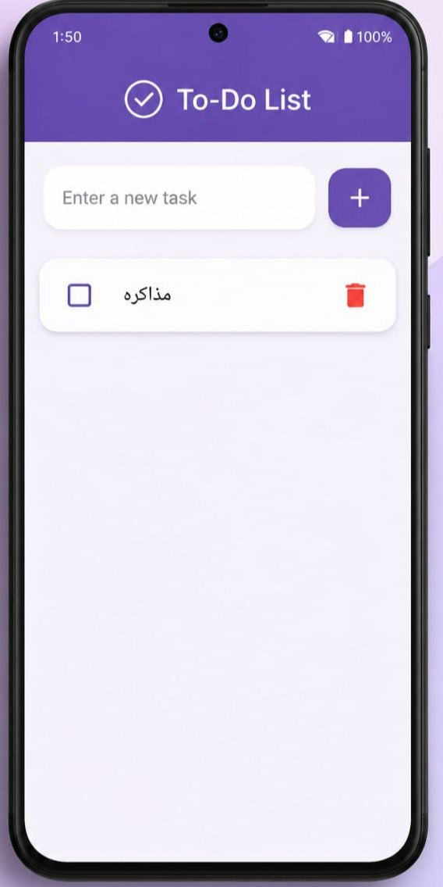

<p align="center">
  
</p>

<h3 align="center">
Building elegant, scalable, and user-focused mobile applications with Flutter 💙
</h3>

<p align="center">
  <a href="https://www.linkedin.com/in/noran-khaled-422422341">
    
  </a>
  <a href="mailto:norankhaled1132004@gmail.com">
    
  </a>
  <a href="https://github.com/norankhaled1132004-art">
    
  </a>
</p>

---

# 💫 About Me

```yaml
name: Noran Khaled
role: Flutter Developer
specialization: Cross-Platform Mobile Development
focus: Clean Architecture | Firebase | REST APIs | State Management
open_to: Flutter Internship / Junior Flutter Opportunities
```

I’m a Flutter developer passionate about building responsive, scalable, and visually polished mobile applications.  
I enjoy turning ideas into smooth user experiences while writing clean, maintainable code and continuously improving my engineering skills.

---

# 🛠 Tech Stack

<p align="center">
  
</p>

<p align="center">
  
  
  
  
  
  
</p>

---

# 🌟 Featured Project

## 🏥 LivoCare — Healthcare Mobile Application

<p align="center">
  
</p>

A healthcare-focused Flutter application designed to streamline patient management, risk assessment, analytics, and medical recommendations through an intuitive mobile experience.

**Highlights:**
- Patient management workflow
- Health analytics dashboard
- Risk prediction results
- Medical recommendation system
- Clean and professional healthcare UI

**Tech Stack:** Flutter • REST API • State Management • UI/UX Design

🔗 **Repository:** https://github.com/norankhaled1132004-art/LivoCar

---

# 📱 Other Projects

<table>
<tr>
<td width="50%">

### 🛒 Shopping App



Modern e-commerce Flutter application with product browsing, wishlist, cart, checkout, and profile management.

**Tech:** Flutter • Firebase • State Management

🔗 https://github.com/norankhaled1132004-art/shoppingapp

</td>

<td width="50%">

### 🌱 Habit Tracker



Productivity-focused habit tracking application with progress monitoring and engaging UI.

**Tech:** Flutter • Local Storage • State Management

🔗 https://github.com/norankhaled1132004-art/habbitapp

</td>
</tr>
</table>

---

## ✅ Todo App

<p align="center">
  
</p>

Simple and clean task management application focused on productivity and local persistence.

**Tech:** Flutter • SQLite • State Management

🔗 **Repository:** https://github.com/norankhaled1132004-art/Todoapp

---

# 📊 GitHub Analytics

<p align="center">
  
  
</p>

<p align="center">
  
</p>

---

# 📬 Let's Connect

<p align="center">
  <a href="https://www.linkedin.com/in/noran-khaled-422422341">
    
  </a>
  <a href="mailto:norankhaled1132004@gmail.com">
    
  </a>
</p>

---

<p align="center">
  <i>"Turning ideas into impactful mobile experiences."</i> ✨
</p>
